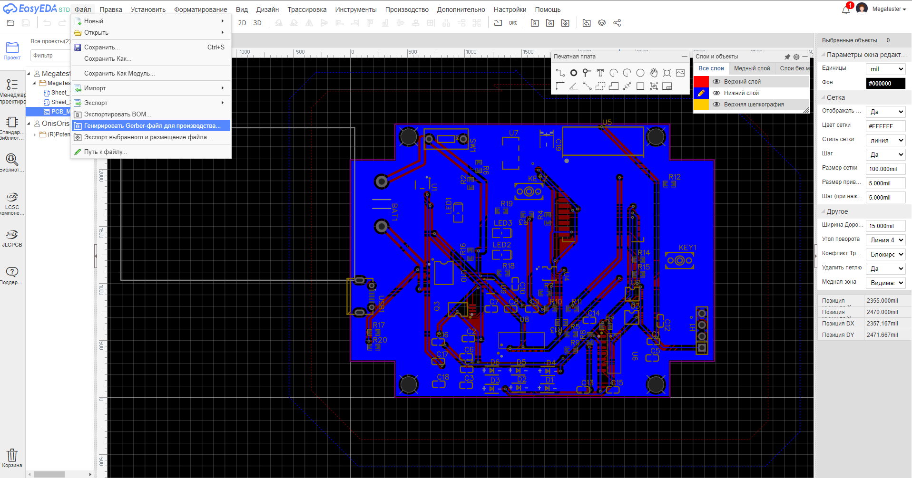
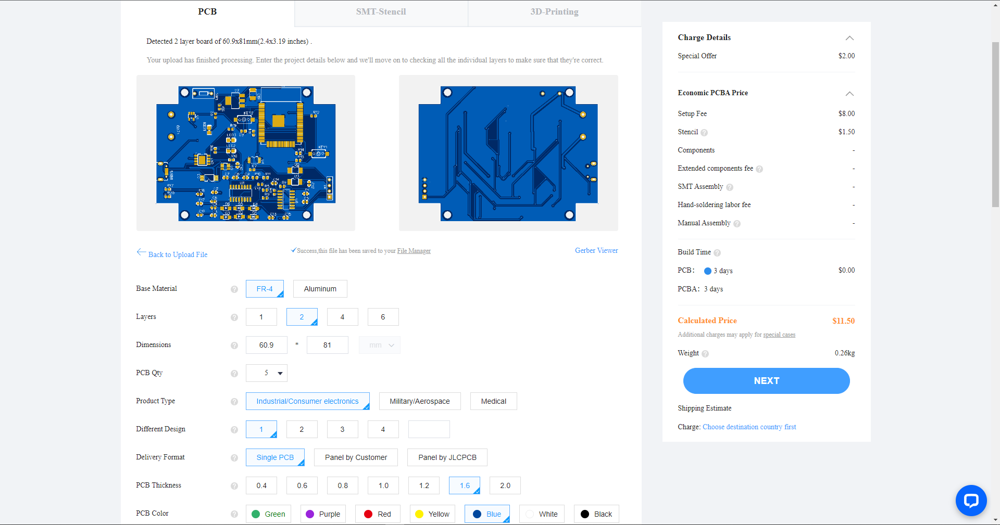
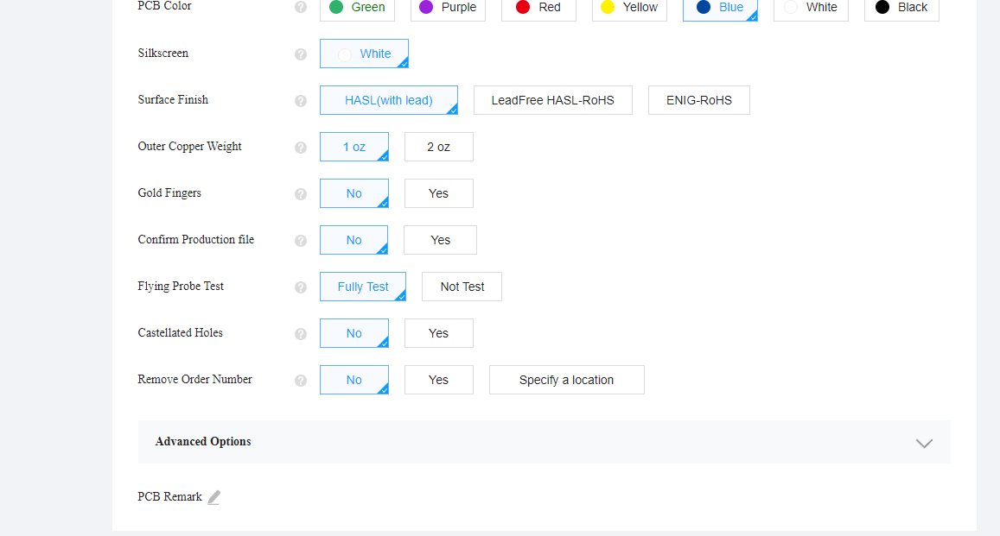
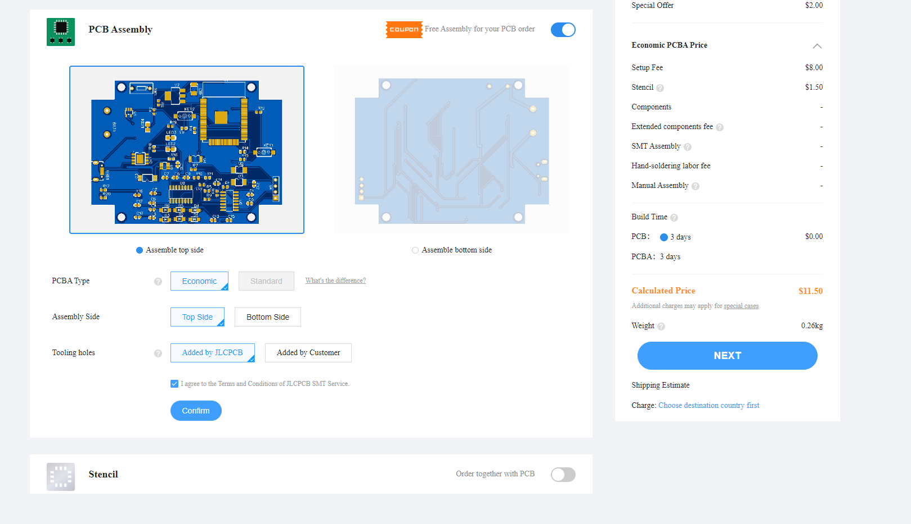
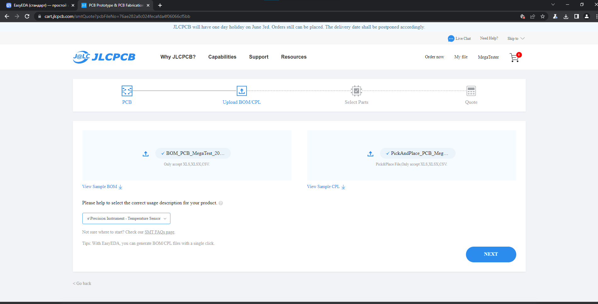
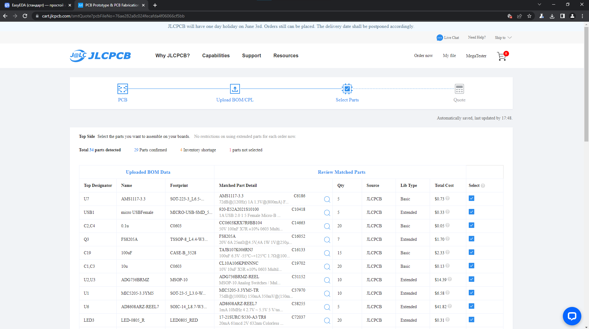
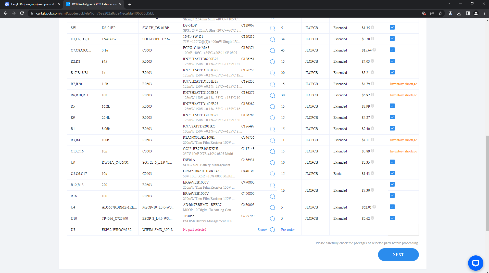
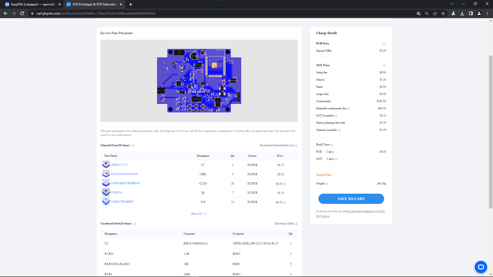
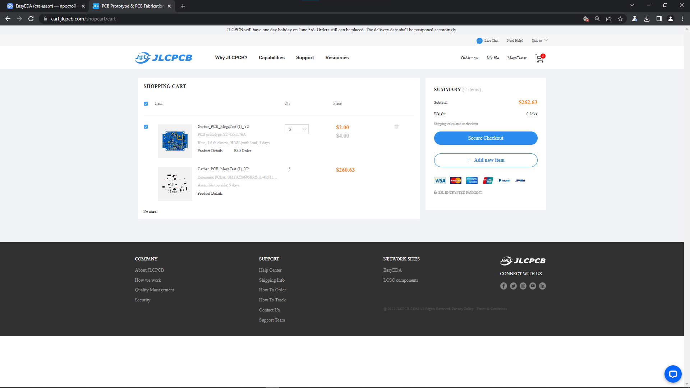

Заказ на JLCpcb
================

Заказ платы
_____________

Нажмите на иконку "Заказать PCB/SMT в один ..."

.. figure:: _static/Pictures/JLCpcb/j2.png
    :scale: 60 %
    :align: center

Выбирите все, как на картинках ниже. Если не подгрузился GERBER файл, то загрузите его (ранее мы скачивали его).

_________________

Заказ монтажа
______________

Ставим галочку на пункте "PCB Assembly", соглашаемся с правилами и нажимаем "CONFIRM".

Если не подгружены файлы BOOM и CENTROID, загружаем их (обычно они загружаются автоматически).
Выбираем область применения платы и нажимаем "NEXT".

В следующем пункте вы можете увидеть перечень элементов и их стоимость, также в этом пункте можно удалить часть элементов из монтажа.

Нажимаем "SAVE TO CART" и далее оплачиваем заказ.

