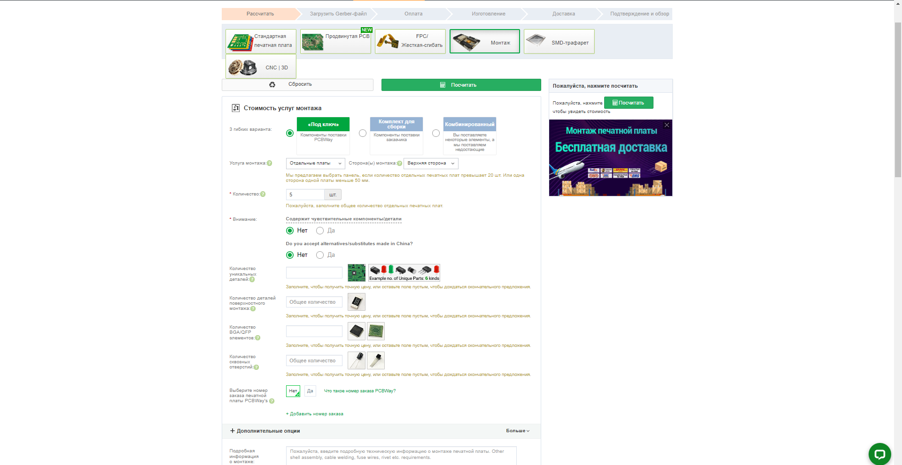
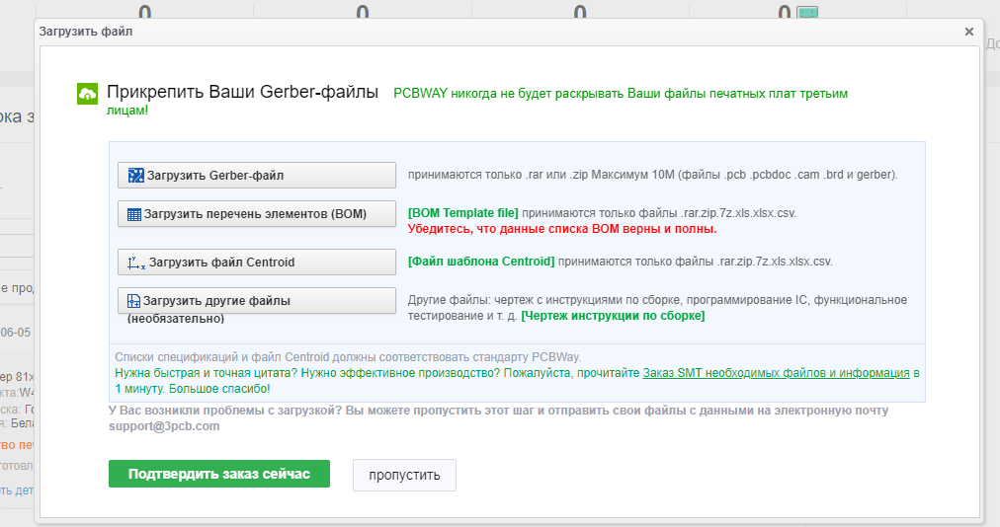
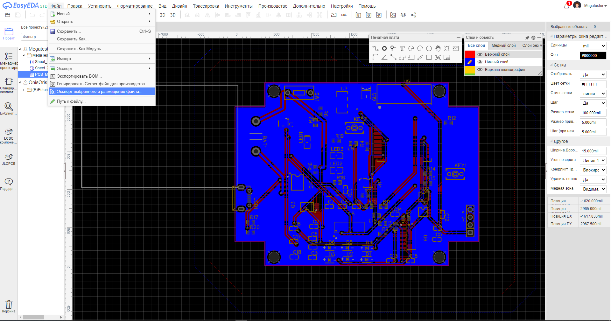

Заказ на PCBway
================

Заказ платы
_____________

Для заказа изготовления платы нажмите на иконку "Онлайн подсчет стоимости". 

.. figure:: _static/Pictures/PCBway/pcbway1.png
    :scale: 50 %
    :align: center

Далее выбираем параметры платы такие же, как на двух картинках ниже.

.. figure:: _static/Pictures/PCBway/pcbway2.png
    :scale: 40 %
    :align: center

Нажмите на кнопку посчитать.

.. figure:: _static/Pictures/PCBway/pcbway3.png
    :scale: 40 %
    :align: center

Здесь можно посмотреть предварительную стоимость платы.

.. figure:: _static/Pictures/PCBway/pcbway4.png
    :scale: 80 %
    :align: center

_________________

Заказ монтажа
______________

Загружаем gerber, BOM и Centroid файлы. Как загрузить Centroid файл с проекта в EasyEDA, показано ниже.

Выбираем "Экспорт выбранного и размещенного файла". Это и есть наш centroid файл.
Centroid файл содержит необходимую информацию для размещения деталей поверхностного монтажа на печатных платах с помощью автоматизированного оборудования, например: координаты x, y, направление вращения.

