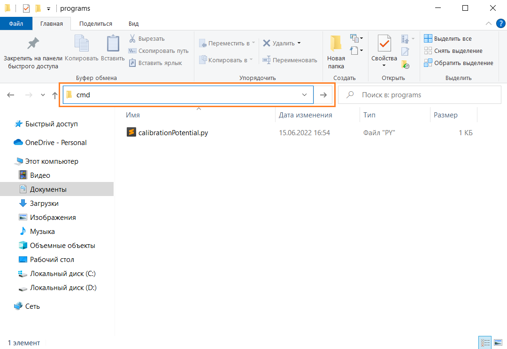

Калибровка потенциостата
=========================

Калибровка подаваемого напряжения
_____________________________________


Для того чтобы найти зависимость между подаваемым на ЦАП 16-битным значением и результирующим напряжением на электродах выполним калибровку.


Установка напряжения WORKING
-----------------------------

Калибровка выполняется для конкретного выбранного неизменяемого напряжения на электроде WORKING. Напряжение на каждом электроде возможно задать в диапазоне от 0 до 3.3 вольт. Выберем напряжение для WORKING в середине этого диапазона, чтобы максимальные по модулю отрицательное и положительное напряжения на электродах были примерно одинаковы. Пусть напряжение WORKING будет равно 1.5 В. Для того, чтобы задать такое напряжение, необходимо подключить потенциостат к компьютеру, загрузить в него прошивку calibration.ino и ввести следующие команды в последовательный порт:

1. C(1) - устанавливаем режим измерения тока

2. D(2) - устанавливаем двухэлектродный режим работы (замыкаем электроды COUNTER и REFERENCE)

После этого задаём напряжение, близкое к 1.5 В, на электрод WORKING с помощью команды B(22000). Измерим реальное напряжение мультиметром. Для этого переведем мультиметр в режим вольтметра с диапазоном не менее 2В. 

Подключим щуп "+" к электроду WORKING, а щуп "-" к контакту земли GND. Считаем значение напряжения с экрана. Если полученное напряжение меньше желаемого, то постепенно увеличиваем значение 16-битного числа, подаваемого на ЦАП, то есть B(x), где x>22000, до достижения желаемого значения в 1.5 В. Если полученное напряжение больше желаемого, соответственно, уменьшаем. В результате, получим желаемое напряжение на электроде WORKING и соответствующее ему значение 16-битного числа на ЦАП.


Процесс калибровки
--------------------

Для калибровки напряжения на электродах подключим потенциостат к компьютеру, загрузим прошивку calibration.ino и выполним команды:

1. C(1) - устанавливаем режим измерения тока

2. D(2) - устанавливаем двухэлектродный режим работы (замыкаем электроды COUNTER и REFERENCE)

3. B(x) - устанавливаем напряжение на WORKING, x~=22000, находится в предыдущей части.
Последовательно будем выполнять команду A(y), которая аналогично команде B(x) задаёт напряжение на электроде REF. Здесь "у" будем менять в диапазоне от 5000 до 45000 с шагом в 5000. Для каждого выполнения команды A(y) измеряем разницу напряжения на электродах мультиметром. Для этого переведем мультиметр в режим вольтметра с диапазоном не менее 2В. Подключим щуп "+" к электроду WORKING, а щуп "-" к электроду REFERENCE. Считаем значение напряжения с экрана и запишем. Получим 2 вектора. Первый вектор с 16-битными значениями, поданными на ЦАП, а второй - с соответствующими им напряжениями на электродах.


Получение линейной зависимости
--------------------------------

Аппроксимируем полученные данные до линейной зависимости и получим коэффициенты, связывающие 16-битное значение, поданное на ЦАП, с соответствующим ему напряжением на электродах. 
Для этого введем полученные данные в переменные DACref и Vdelta программы на языке Python:

import numpy as np

# Параметры теста

#B(21930);C(1); D(2);  Vref(delta=0)=22112; Vref(delta=1)=7361;

#Vref(delta=-1)=36863; Vref(0.6)=13239; Vref(-0.6)=30959;

# Вектор 16-битных значений, подаваемых на электрод REF

DACref=np.array([0, 1000, 5000, 10000, 15000, 20000, 25000, 30000, 35000, 40000, 45000, 48000])

# Вектор полученных напряжений между WORK и REF

Vdelta=np.array([1.488, 1.432, 1.161, 0.821, 0.482, 0.143, -0.196, -0.535, -0.874, -1.213, -1.552, -1.754])

# Аппроксимация к линейной функции

X=np.polyfit(DACref,Vdelta,1)

# Сравнение аппроксимации с реальными значениями

VdelRes=DACref*X[0]+X[1]

Vdiff=Vdelta-VdelRes

print("k: "+str(X[0]))

print("b: "+str(X[1]))

print("Vdiff: "+str(Vdiff))

Сохраним код с именем ```calibrationPotential.py```

Для запуска необходимо иметь установленный Python, [инструкция по установке](https://pythonworld.ru/osnovy/skachat-python.html).

Чтобы запустить код программы, перейдем в папку, в которой находится программа:


Введем в адресной строке `cmd` и нажмем `Enter`.



Откроется командная строка, в которой вводим команду `python calibrationPotential.py` и нажимаем `Enter`.


Коэффициенты `k` и `b` будут результатом калибровки подаваемого напряжения.


