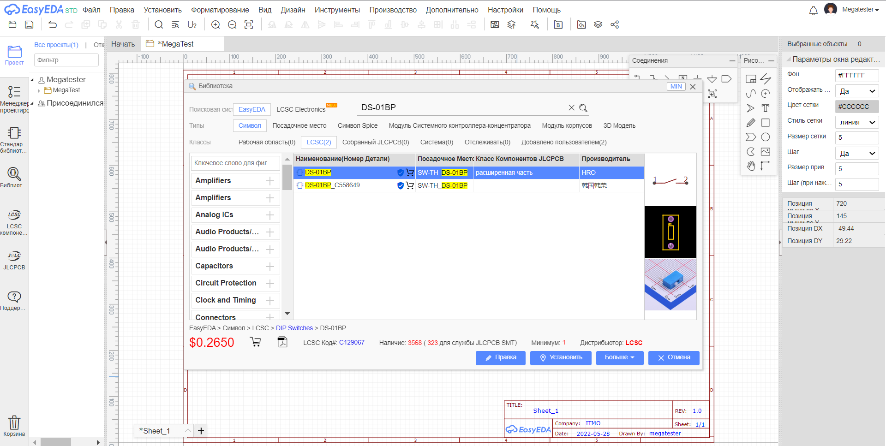
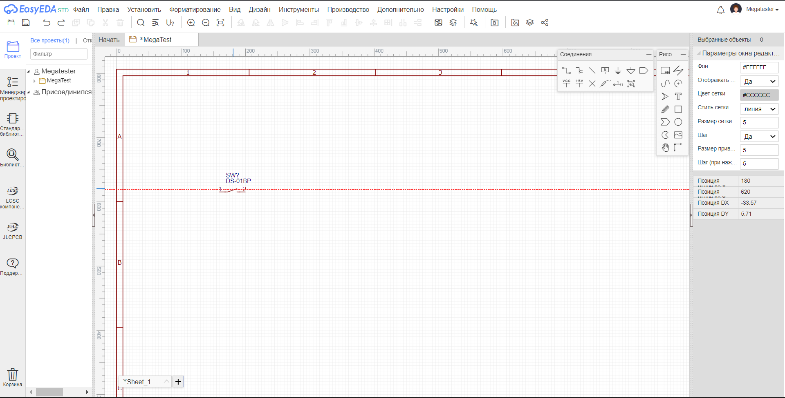
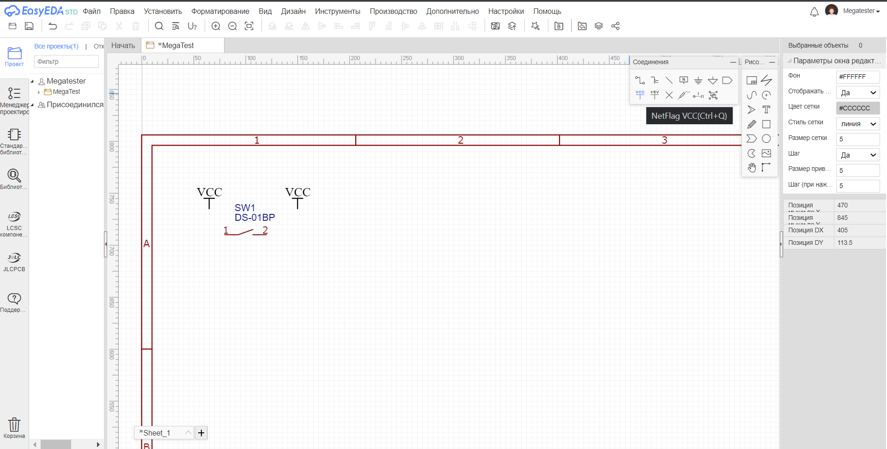
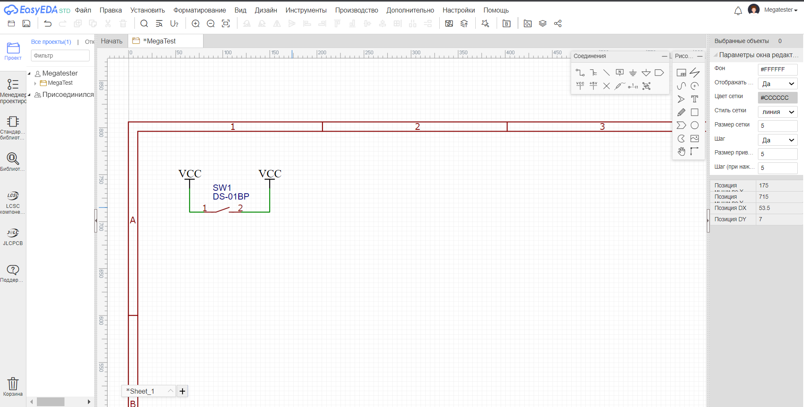
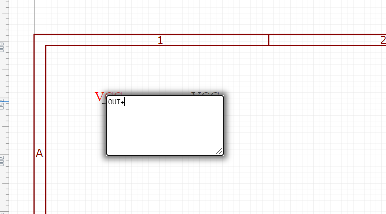
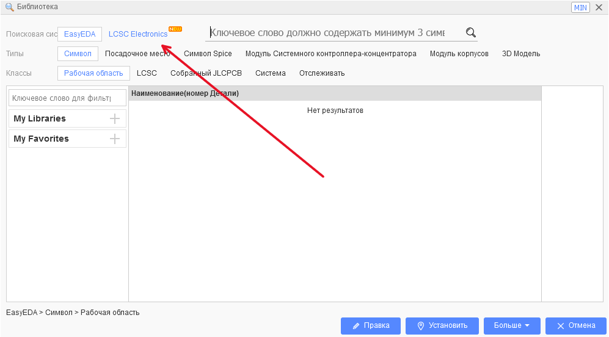
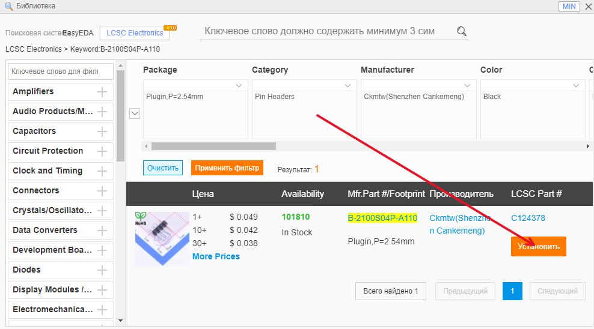
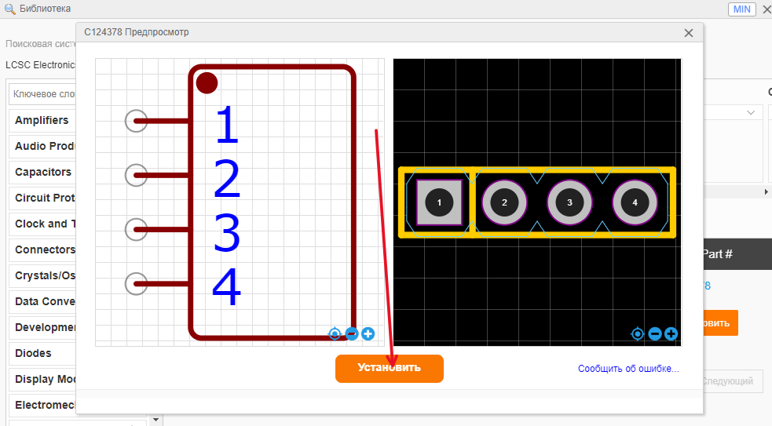

Работа в easyEDA
=================

Регистрация
____________

Главная страница
-----------------

На главной странице справа сверху нажимаем на "Зарегистрироваться".

.. figure:: _static/Pictures/easyEDA/reg1.png
    :scale: 30 %
    :align: center

-----------------

Создание аккаунта
------------------

Вводим пароль и проходим проверку на робота.

.. figure:: _static/Pictures/easyEDA/reg2.png
    :scale: 30 %
    :align: center

----------

Завершение
----------

.. figure:: _static/Pictures/easyEDA/reg3.png
    :scale: 30 %
    :align: center

___________________________________

Создание проекта с потенциостатом
____________________________________

Переходим во вкладку с редактором.

.. figure:: _static/Pictures/easyEDA/newScheme1.png
    :scale: 30 %
    :align: center

Выбираем STD Edition.

.. figure:: _static/Pictures/easyEDA/newScheme2.png
    :scale: 30 %
    :align: center

Создаем новый проект.

.. figure:: _static/Pictures/easyEDA/newScheme3.png
    :scale: 30 %
    :align: center

Выбираем название проекта.

.. figure:: _static/Pictures/easyEDA/newScheme4.png
    :scale: 30 %
    :align: center

После этого создается файл, где можно начинать создавать нашу электросхему.

.. figure:: _static/Pictures/easyEDA/newScheme4.5.png
    :scale: 30 %
    :align: center

Нажмите сочетание клавиш "Shift+f" или зайдите во вкладку "Установить -> Символ" и в поиске введите "DS-01BP" для поиска переключателя и нажимаем на кнопку "установить".

Кнопкой на мыши "ЛКМ" устанавливаем переключатель на рабочее поле. Колесиком миши можно масштабировать рабочее поле.

Далее необходимо подключить переключатель к контактам "VCC" и "OUT+". Создаем два NetFlag с помощью "Ctrl+Q".

Подключаем NetFlag к контактам переключателя с помощью Wire, нажимая на кнопку "W" и "ЛКМ" на контакты компонента. 

Далее двойной "ЛКМ" по левому NetFlag и меняем его название на "OUT+".

Нажимаем shift+F и выбираем LCSC electronics.

В поисковой строке ищем B-2100S04P-A110 и устанавливаем на схему.

Процесс установки на гифке:

.. figure:: _static/Pictures/easyEDA/EasyEda.gif
    :scale: 40 %
    :align: center

Далее установим линейный стабилизатор напряжения MIC5205-3.3YM5 со всей необходимой обвязкой.

Данных навыков достаточно для дальнейшего построения схемы.

Постройте две схемы: с микроконтролером и со схемой питания. После этого можно приступать к разведению платы.

