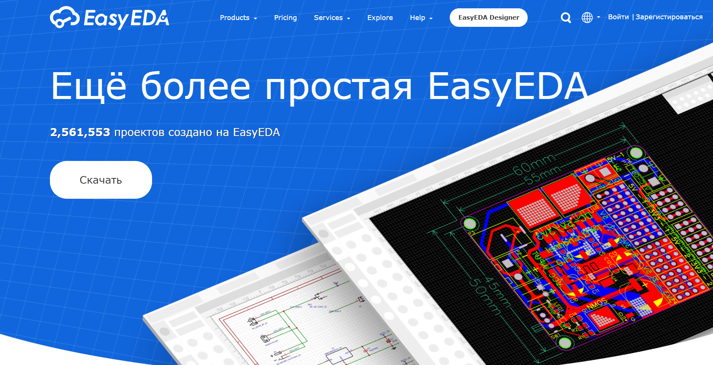
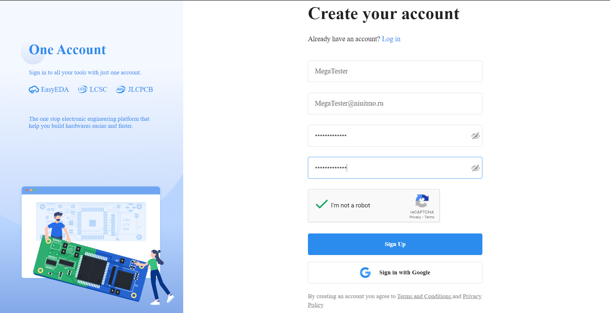
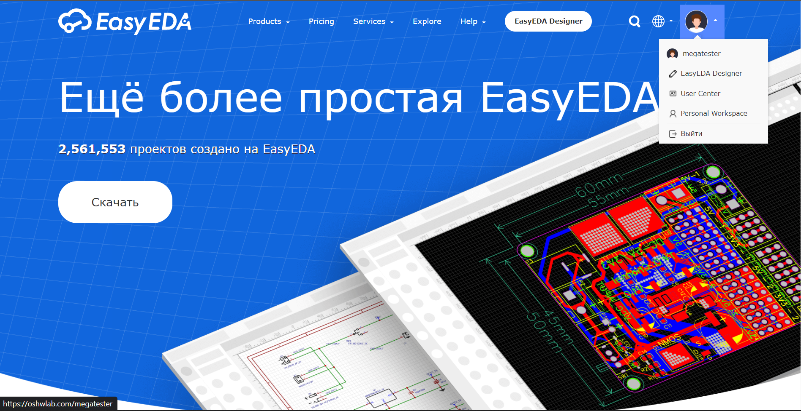
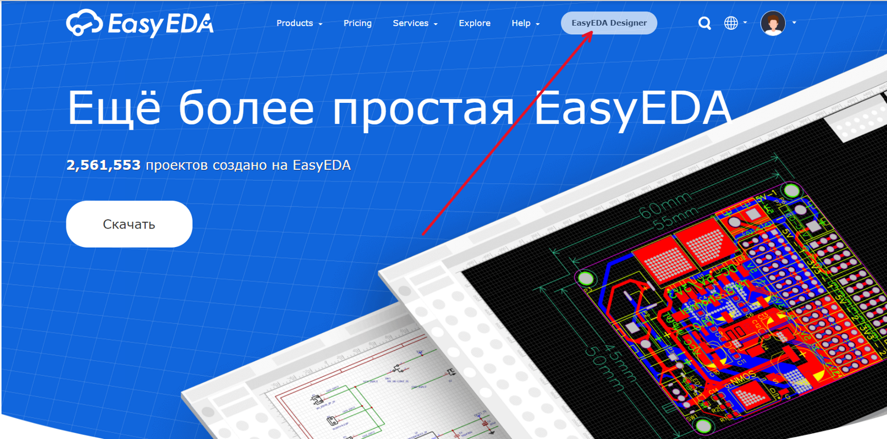
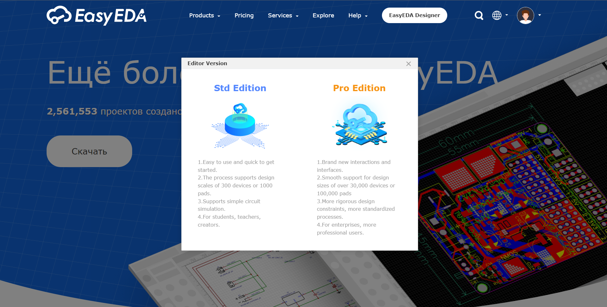
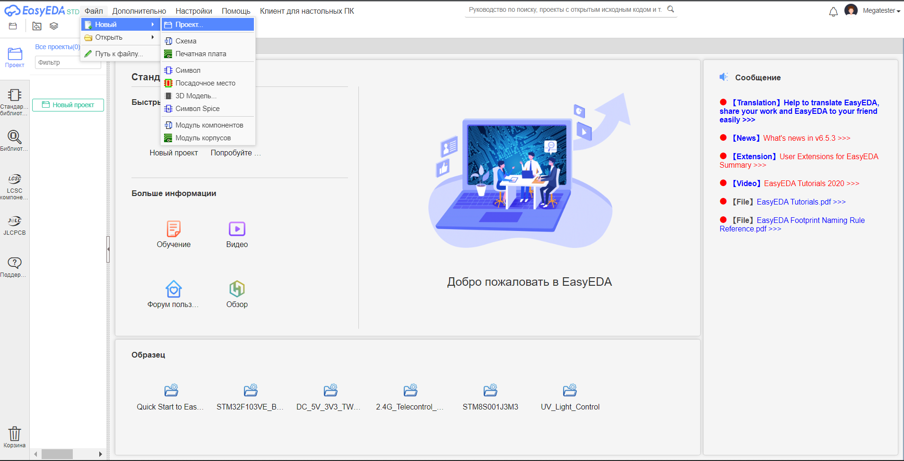
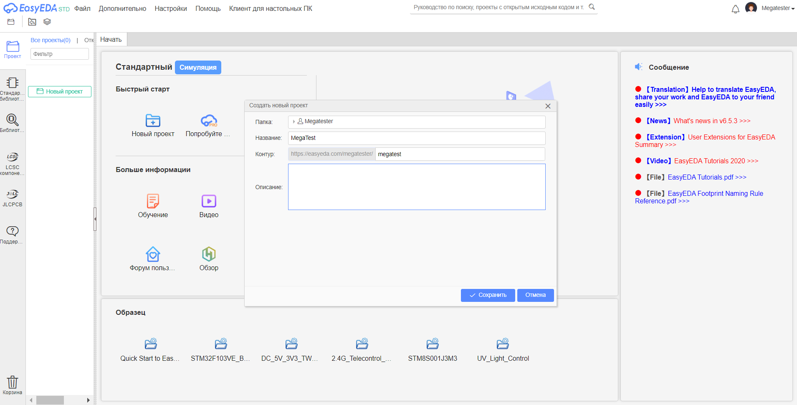
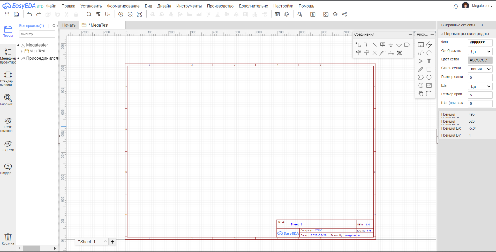

Работа в easyEDA
=================

Регистрация
____________

Главная страница
-----------------

На главной странице справа сверху нажимаем на "Зарегистрироваться".

-----------------

Создание аккаунта
------------------

Вводим пароль и проходим проверку на робота.

----------

Завершение
----------

___________________________________

Создание проекта с потенциостатом
____________________________________

Переходим во вкладку с редактором.

Выбираем STD Edition.

Создаем новый проект.

Выбираем название проекта.

После этого создается файл, где можно начинать создавать нашу электросхему.

