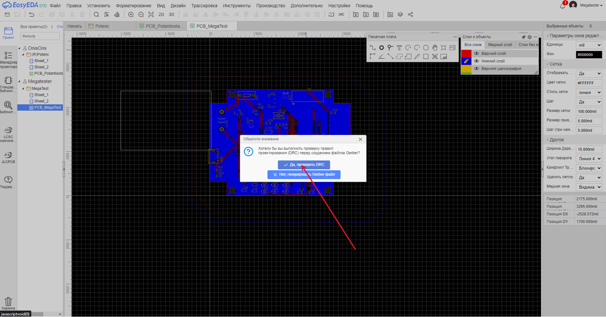

Работа в easyEDA
=================

Регистрация
____________

Главная страница
-----------------

На главной странице справа сверху нажимаем на "Зарегистрироваться".

.. figure:: _static/Pictures/easyEDA/reg1.png
    :scale: 30 %
    :align: center

-----------------

Создание аккаунта
------------------

Вводим пароль и проходим проверку на робота.

.. figure:: _static/Pictures/easyEDA/reg2.png
    :scale: 30 %
    :align: center

----------

Завершение
----------

___________________________________

Создание проекта с потенциостатом
____________________________________

Переходим во вкладку с редактором.

.. figure:: _static/Pictures/easyEDA/newScheme1.png
    :scale: 30 %
    :align: center

Выбираем STD Edition.

Создаем новый проект.

Выбираем название проекта.

После этого создается файл, где можно начинать создавать нашу электросхему.

.. figure:: _static/Pictures/easyEDA/newScheme4.5.png
    :scale: 30 %
    :align: center

Нажмите сочетание клавиш "Shift+f" или зайдите во вкладку "Установить -> Символ" и в поиске введите "DS-01BP" для поиска переключателя и нажимаем на кнопку "установить".

Кнопкой на мыши "ЛКМ" устанавливаем переключатель на рабочее поле. Колесиком миши можно масштабировать рабочее поле.

Далее необходимо подключить переключатель к контактам "VCC" и "OUT+". Создаем два NetFlag с помощью "Ctrl+Q".

.. figure:: _static/Pictures/easyEDA/newScheme7.png
    :scale: 30 %
    :align: center

Подключаем NetFlag к контактам переключателя с помощью Wire, нажимая на кнопку "W" и "ЛКМ" на контакты компонента. 

Далее двойной "ЛКМ" по левому NetFlag и меняем его название на "OUT+".

Нажимаем shift+F и выбираем LCSC electronics.

.. figure:: _static/Pictures/easyEDA/newScheme10.png
    :scale: 65 %
    :align: center

В поисковой строке ищем B-2100S04P-A110 и устанавливаем на схему.

.. figure:: _static/Pictures/easyEDA/newScheme12.png
    :scale: 65 %
    :align: center

Процесс установки:

https://niuitmo-my.sharepoint.com/personal/onisoris_niuitmo_ru/_layouts/15/stream.aspx?id=%2Fpersonal%2Fonisoris%5Fniuitmo%5Fru%2FDocuments%2FMyProjects%2F%D0%9F%D0%BE%D1%82%D0%B5%D0%BD%D1%86%D0%B8%D0%BE%D1%81%D1%82%D0%B0%D1%82%2FEasyEda%2Emp4&ga=1

Далее установим линейный стабилизатор напряжения MIC5205-3.3YM5 со всей необходимой обвязкой.

Данных навыков достаточно для дальнейшего построения схемы.

Постройте две схемы: с микроконтролером и со схемой питания. После этого можно приступать к разведению платы.

Преобразование в печатную плату
________________________________

Для преобразования в печатную плату переходим во вкладку "Дизайн" нажимаем "Преобразовать схему в печатную плату", либо просто зажимаем комбинацию клавишь "Alt+P".

Проверяем цепи, нажимая "Да, проверить Цепи".

Для примера я разместил не соединенную землю, причем найти такие элементы можно, нажав лкм по проблемному элементу в левом столбце.

https://niuitmo-my.sharepoint.com/personal/onisoris_niuitmo_ru/_layouts/15/stream.aspx?id=%2Fpersonal%2Fonisoris%5Fniuitmo%5Fru%2FDocuments%2FMyProjects%2F%D0%9F%D0%BE%D1%82%D0%B5%D0%BD%D1%86%D0%B8%D0%BE%D1%81%D1%82%D0%B0%D1%82%2FEasyEda%2Emp4&ga=1

Перед преобразованием необходимо сохранить проект, нажимаем "Ctrl+s".
Далее нажимаем снова "Alt+P", а после "Нет, продолжить".

Пример создания границ платы, размеров 81x69.9 мм. 
Обратите внимание, что вам необходимо создать границы размером 81x60.9 мм.

https://niuitmo-my.sharepoint.com/personal/onisoris_niuitmo_ru/_layouts/15/stream.aspx?id=%2Fpersonal%2Fonisoris%5Fniuitmo%5Fru%2FDocuments%2FMyProjects%2F%D0%9F%D0%BE%D1%82%D0%B5%D0%BD%D1%86%D0%B8%D0%BE%D1%81%D1%82%D0%B0%D1%82%2FEasyEda%2Emp4&ga=1

Далее необходимо создать углубления по бокам платы, а также отверстия. Для удобства можно пользоваться схемой и таблицей с координатами отверстий, указанных ниже.

Диаметр отверстий 3.50 мм.

.. csv-table:: Координаты отверстий
   :header: "Отверстие № ", "X, мм", "Y, мм"
   :widths: 10, 10, 10

   "Отверстие 1", 13.00, 2.85

   "Отверстие 2", 13.00, 58.05

   "Отверстие 3", 68.00, 58.05

   "Отверстие 4", 68.00, 2.85 

Пример создания квадратных углублений и отверстий в плате:

https://niuitmo-my.sharepoint.com/personal/onisoris_niuitmo_ru/_layouts/15/stream.aspx?id=%2Fpersonal%2Fonisoris%5Fniuitmo%5Fru%2FDocuments%2FMyProjects%2F%D0%9F%D0%BE%D1%82%D0%B5%D0%BD%D1%86%D0%B8%D0%BE%D1%81%D1%82%D0%B0%D1%82%2FEasyEda%2Emp4&ga=1

В итоге ваш результат должен быть выгядеть, как на картинке:

____________________________

Разведение компонентов платы
_____________________________

Разместите все компоненты платы примерно так, как показано на рисунке.
Компоненты можно поворачивать, нажимая на кнопку "R".

____________________________

Автотрассировка
_______________

Автотрассировка необходима для расчета оптимальных путей дорожек на плате.
Выберем во вкладке "Трассировка" пункт "Автотрассировка..."

Выбираем облачный сервер трассировки и запускаем.

В результате получится что-то подобное.

Далее необходимо увеличить силовые линии "OUT+" и "BAT1_-", выбираем линии через shift и в парвом верхнем углу выставляем ширину 30 mil.

Для снижения шумов и для удобного доступа к земле необходимо "залить" медным слоем, соедененным с землей, пространство между дорожками. Для этого выбираем инструмент Copper Area буквой E или в панеле с инструментами.

https://niuitmo-my.sharepoint.com/personal/onisoris_niuitmo_ru/_layouts/15/stream.aspx?id=%2Fpersonal%2Fonisoris%5Fniuitmo%5Fru%2FDocuments%2FMyProjects%2F%D0%9F%D0%BE%D1%82%D0%B5%D0%BD%D1%86%D0%B8%D0%BE%D1%81%D1%82%D0%B0%D1%82%2FEasyEda%2Emp4&ga=1

Для редактирования второго слоя выбираем значок карандаша у второго слоя в панеле "Слои и объекты".

Просмотреть 3D вид модели можно во вкладке "Вид" -> "3D вид".

Подготовка файлов для производства платы
_________________________________________

Для производства необходимо несколько файлов. Один из них - Boom файл со списком всех компонентов. 

Выбираем "Экспортировать Boom".

.. figure:: _static/Pictures/easyEDA/boom2.png
    :scale: 40 %
    :align: center

Сохраняем проект, после чего экспортируем Gerber файл. 

Нажимаем "Да, проверить...". В случае, если есть ошибки, EasyEDA покажет, в каких местах они есть и поможет их исправить. В случае, если их нет, то перекинет на следующую вкладку.

Генерируем Gerber файл:

После этого скачивается нужный нам файл в .zip расширении. 

