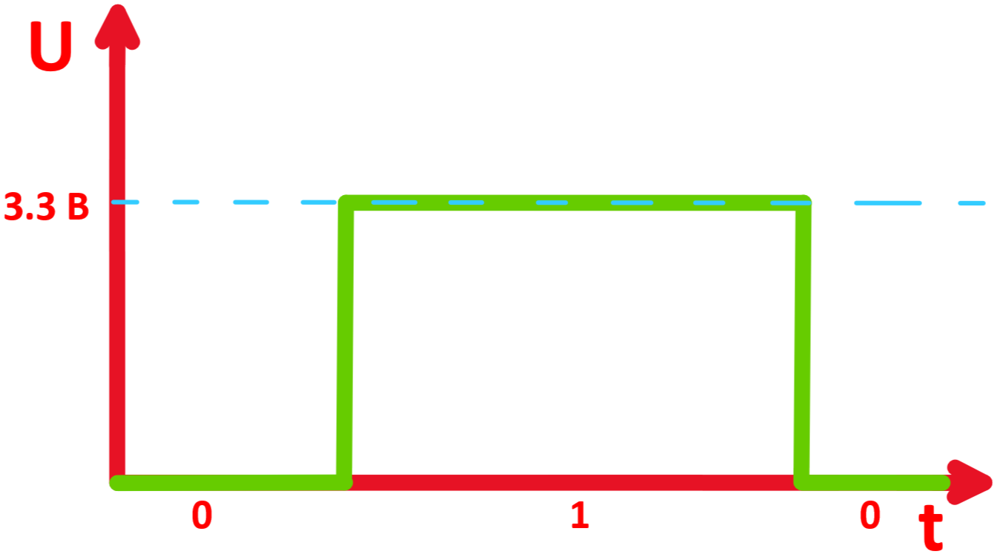

Электрическая схема устройства
===============================

Управляющий микроконтроллер (1)
ЦАП (2)
Ключ (3)
Кнопка (4)
Стабилизатор напряжения на 3.3 [В] (5)
Операционные усилители (6)
Стабилизатор напряжения 3.3 В (7)
Разъем micro usb (8)
CH340C (9)
Кнопки (10)
DW01A (11)
FS8205A (8205A), транзистор с двойным N-каналом (12)
Аккумулятор 
TP4056, Контроллер заряда Li-Ion батари (14)

Основными частями потенциостата являются формирующее входной сигнал устройство, три контакта для подключения электрохимической ячейки и дифференциальный усилитель сравнивающий выходной и входной потенциалы.
На рисунке ниже изображена функциональная схема измерительного устройства. В качестве генератора входного сигнала выступает микроконтроллер с цифро-аналоговым преобразователем (ЦАП), то есть микроконтроллер передаёт на ЦАП число в двоичном коде, а ЦАП преобразует его в электрический потенциал. Например, в электрической схеме нашего потенциостата используется 16-битный ЦАП, подключённый к питанию от 3,3 В. Это значит, что наш ЦАП делит отрезок от 0 до 3,3 вольт на 216 значений и может выдавать любое из них на выходе. Далее этот сигнал идёт на сглаживающие фильтры в схеме обработки входного сигнала, то есть удаляются помехи, при этом аналоговые ключи в схеме задают схему подключения электродов: либо двухэлектродную, либо трехэлектродную.

После генерации данный сигнал подаётся на специальную электрохимическую ячейку по двум электродам, которые принято называть вспомогательным (COUNTER) и потенциальным (REF). С третьего подключенного электрода, который называется рабочим (WORK), снимается выходной сигнал и сравнивается с входным с помощью дифференциального усилителя (электрической схемы, которая при сравнении двух сигналов усиливает их разность, чтобы увеличить точность измерений). 

Конечный сигнал возвращается на микроконтроллер с помощью встроенного аналого-цифрового преобразователя (АЦП), далее микроконтроллер производит простейшую обработку и отправку сигнала на подключенное устройство для дальнейшего анализа.

Управляющий микроконтроллер
____________________________

В качестве управляющего микроконтроллера был выбрана платформа ESP32-WROOM-32. Одним из плюсов данной версии является то, что у него на кристалле находится Wi-Fi и Bluetooth модуль, что не требует установку дополнительных модулей. Также ESP32 отличается низким энергопотреблением.

Внешний вид платформы представлен ниже.

Цифро-аналоговый преобразователь (ЦАП) AD5667R
________________________________________________

ЦАП преобразовывает дискретный (цифровой) сигнал в аналоговый, позволяя создавать непрерывный сигнал сложной формы на выходе. Управление выходным сигналом идет через интерфейс I2C, подключаемый к контактам SDA и SCL. 

Дискретный сигнал может принимать только два значения - 1 или 0. В качестве единицы может выступать напряжение на любом значении. В нашем случае логика работает на напряжении 3.3 В. В качестве нуля обычно выстуает нулевое напряжение. 

На картинке ниже показан пример дискретного сигнала, который работает в логике 3.3 В.

Аналоговый же сигнал может существовать в произвольной форме.

В потенциостате ЦАП используется для задания линейно-возрастающего сигнала на электроды (с выхода OUTA), а также для задания нуля для измеряемого сигнала на выходе с дифференциального усилителя (номер U6.4)

Ключ ADG736BRMZ
________________

ADG736BRMZ - низковольтный двухканальный переключатель на два направления. 

На картинке ниже представлен принцип работы данного переключателя:
+ если на вход (Signal) подается положительный сигнал, то переключатель соединяет INPUT1 и OUT.
+ если на вход (Signal) подается нулевой сигнал, то переключатель соединяет INPUT2 и OUT.

Кнопка 
_______

Данный переключатель включает или выключает питание от батареи.

