Программирование
================

Arduino IDE
___________

1. Скачайте(https://www.arduino.cc/en/software) установщик среды разработки Arduino IDE и установите.
2. Подключите потенциостат к компьютеру с запущенной средой Arduino IDE и включите его питание.
3. Скачайте(https://www.arduino.cc/en/software) и установите драйвер CH340.
4. Откройте диспетчер устройств на компьютере и убедитесь, что контроллер платы распознаётся компьтером (как показано на примере):

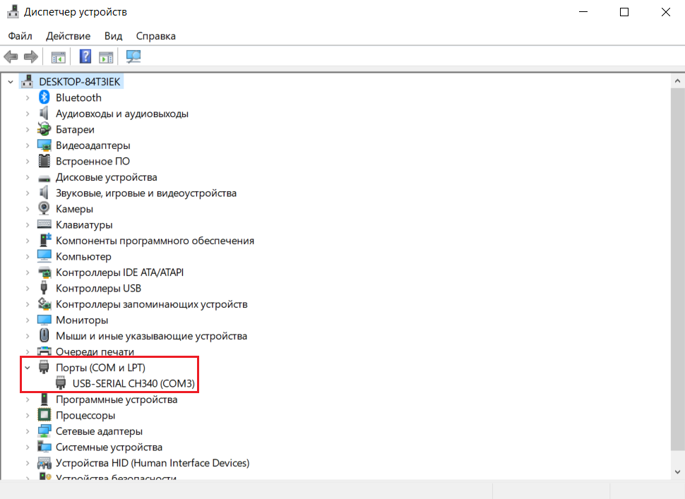

5. Откройте Arduino IDE на компьютере и выберете порт устройства (как показано на примере):

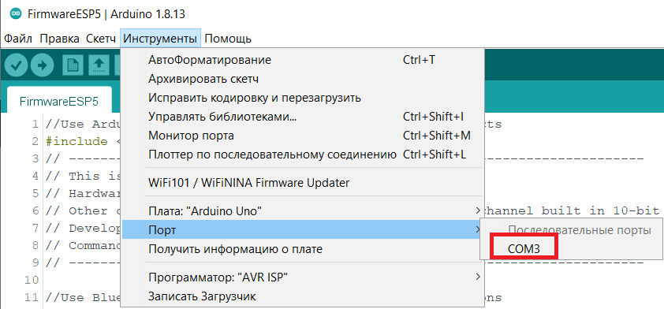

6. Перейдём к установке библиотеки ESP32 в ArduinoIDE. Откроем настройки:

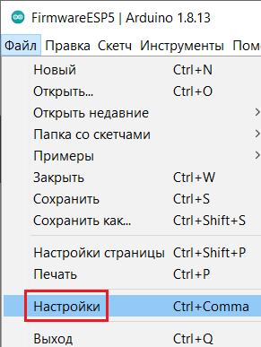

7. В поле `Дополнительные ссылки для Менеджера плат` вставим: `https://dl.espressif.com/dl/package_esp32_index.json,http://arduino.esp8266.com/stable/package_esp8266com_index.json` и нажмем `OK`.

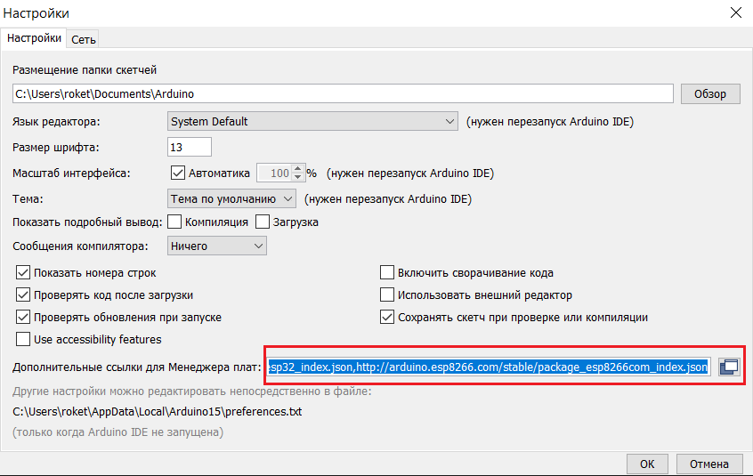

8. Откроем `Менеджер плат`:

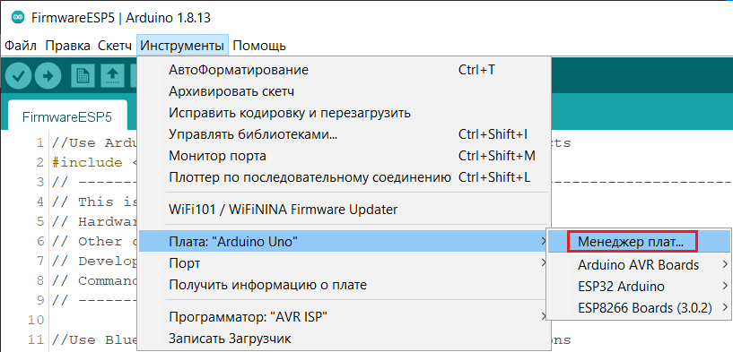

9. В поиске введём `esp32` выберем платы `esp32`, последнюю версию, и нажмём кнопку `Установка`:

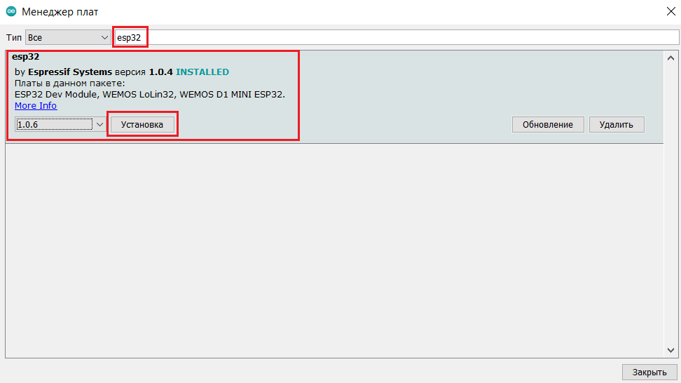

10. Выберем плату `ESP32 Dev Module`:

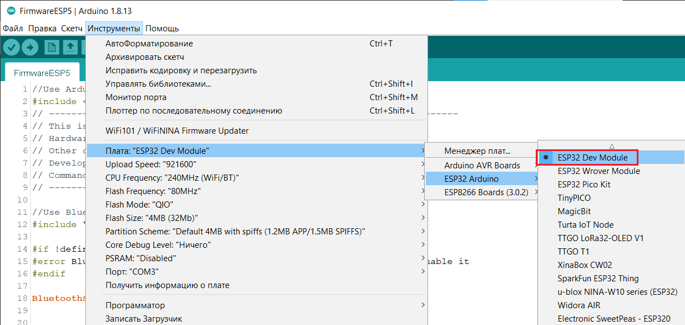

11. Откроем прошивку `FirmwireESP5.ino` и нажмём загрузку:

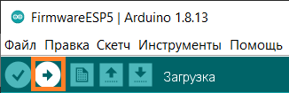

____________________________

Загрузка прошивки в контроллер
__________________________________

GUI приложение
--------------

1. [Скачаем]() архив `scripts.zip` и распакуем его.

2. [Установим](https://www.python.org/downloads/release/python-365/) Python 3.6.5.

3. Перейдём в распакованную папку `scripts` и запустим командную строку. Для этого в адресной строке введём `cmd`.

4. Установим необходимые библиотеки. Для этого введем команду `pip install -r requirements.txt`.

5. Введём команду `python main.py`.

6. При возникновении ошибок во время запуска, связанных с неустановленными библиотеками, выполнить команду `pip install <название недостающей библиотеки>`.

При успешном выполнении всех действий запустится окно программы:

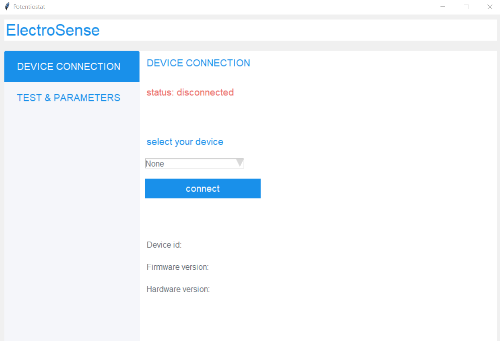

--------------------

Запуск измерения
--------------------

1. Для того, чтобы выполнить измерение потенциостатом, необходимо подключить прошитый потенциостат по USB к компьютеру и включим его питание (переключим выключатель в положение `ON`, светодиод загорится зелёным).

2. В ПО во вкладке `DEVICE CONNECTION` необходимо выбрать устройство. Для этого в поле `select your device` следует открыть список и выбрать порт подключенного потенциостата (узнать его можно в Диспетчере устройств во вкладке `Порты (COM и LPT)`). В данном случае порт `COM3`:

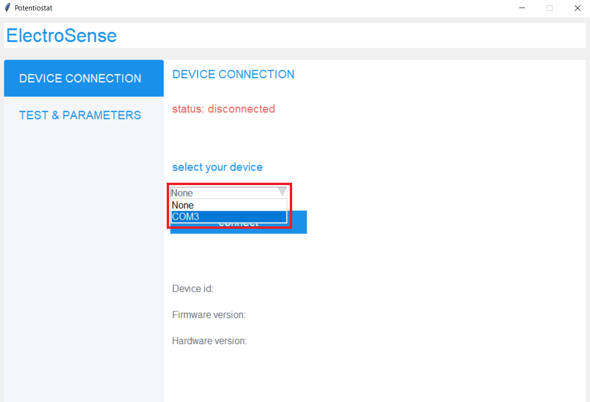

3. Далее нажать кнопку `connect`. При успешном выполнении всех действий статус подключения изменится на `connected`:

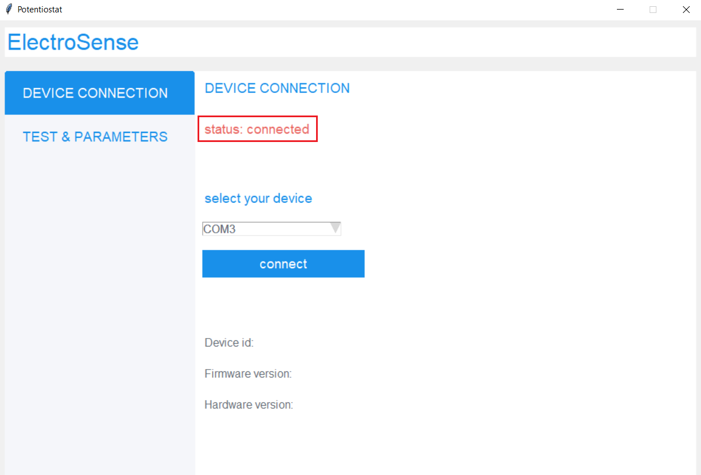

4. Переходим к заданию параметров теста. Для этого перейдем во вкладку `TEST & PARAMETERS`:

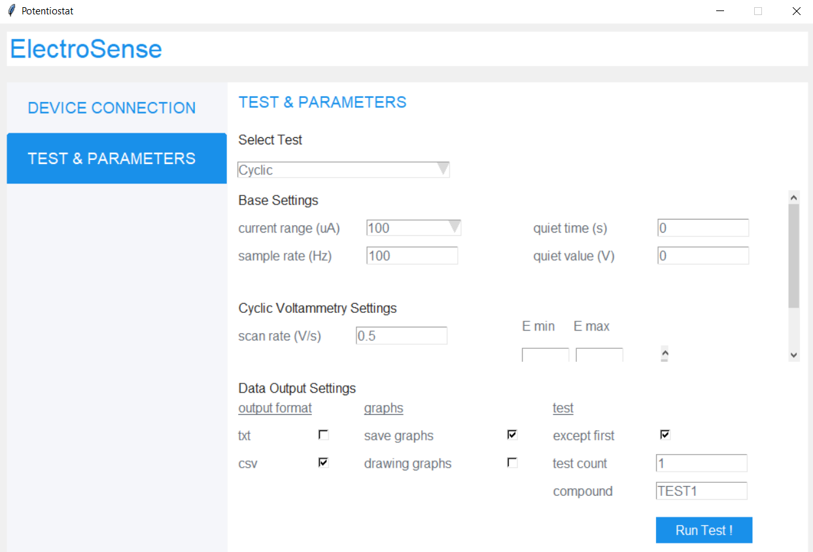

5. Выбираем параметры теста. В поле `select test` доступен только параметр `CYCLIC`. Такой тип теста позволяет выполнить циклическую хроноамперометрию, то есть линейно изменять подаваемое напряжение, измеряя получаемый ток.

В разделе `Base Settings` выберем диапазон токов измерения `current range` равным `100 uA`, который соответствует данному потенциостату. В поле `sample rate` зададим частоту дискретизации (по умолчанию установлено значение `100 Hz`). Поля `quiet time` и `quiet value` для прошивки потенциостата текущей версии неактивны.

В разделе `Cyclic Voltammetry Settings` выберем скорость изменения напряжения в зависимости от поставленной задачи. Установим скорость `scan rate` равной `0.05 V/s`. Зададим предельные значения напряжений в полях `E min` и `E max` равными `-0.6 V` и `0.6 V`, соответственно.

В разделе `Data Output Settings` зададим форматы вывода данных. В колонке `output format` отметим необходимые для вывода форматы данных. В рамках данного примера ставим галочку для формата `csv`(пока неактивно для данной версии API). Выберем, сохранять ли, и выводить ли полученные графики? (Выяснить, не в Велене ли Цири? Выяснить, не в Новиграде ли Цири? Выяснить, не на Скеллиге ли Цири?)(пока неактивно для данной версии API). Для данного примера ставим обе галочки. В поле `except first` выберем, исключить ли первый цикл из эксперимента. оставим чекбокс пустым, чтобы сохранить первый цикл. Зададим количество циклов `test count` равным `3` и назовём тест `compound` именем `TEST1`.

6. Вставим бумажный электрод в разъём для электродов:

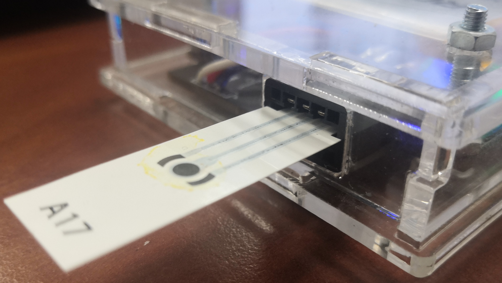

Если электрод слишком тонкий, подложим под него сложенную бумагу для уплотнения и лучшей фиксации:

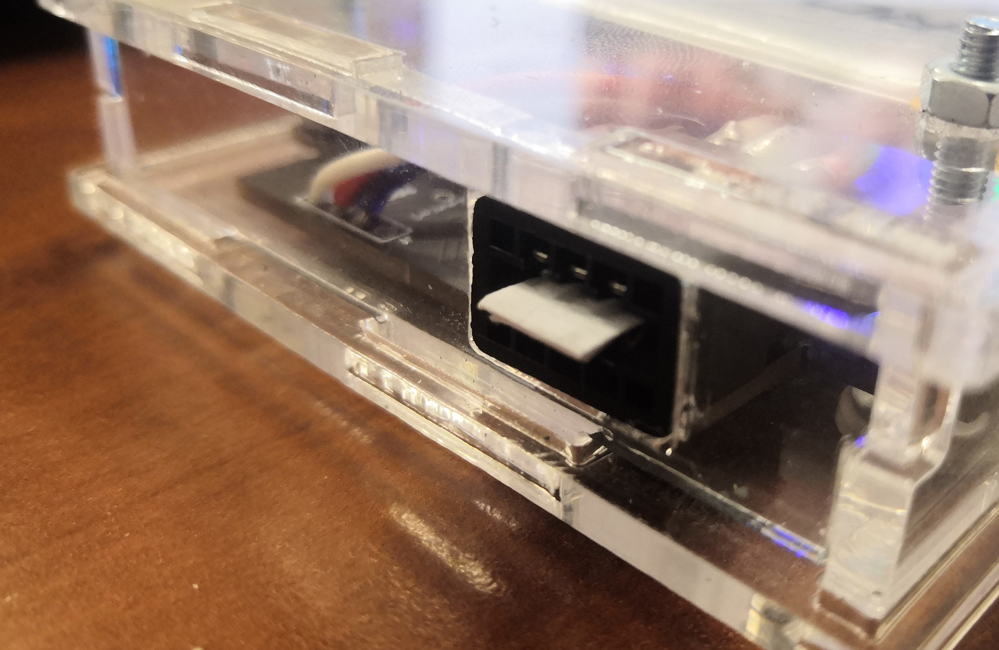

7. Нанесём исследуемый раствор на электрод с помощью пипетки:

.. figure:: _static/Pictures/programming/liquid.jpg
    :scale: 10 %
    :align: center

8. После проверки введённых настроек запустим тест кнопкой `Run Test!`.

9. Для дополнительного отслеживания прогресса можно наблюдать отправляемые потенциостату JSON-команды в командной строке:

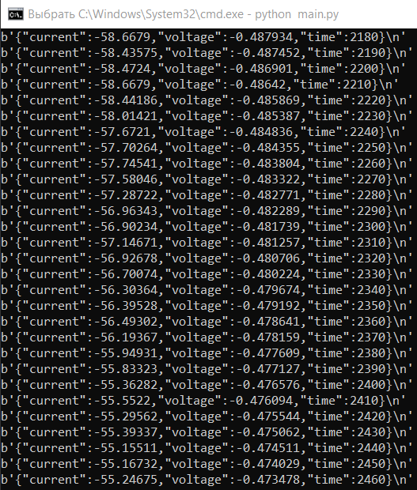

10. После окончания проведения измерений при поставленных галочках ранее появятся графики экспериментов в новых окнах:

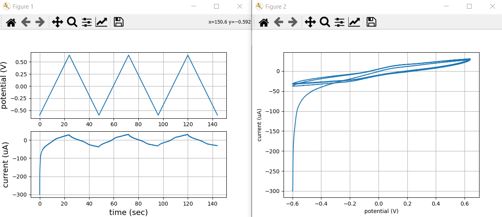

11. При поставленной галочке на сохранение данных теста в папке пользователя в `data` сохранятся данные теста (пока неактивно для данной версии API).

