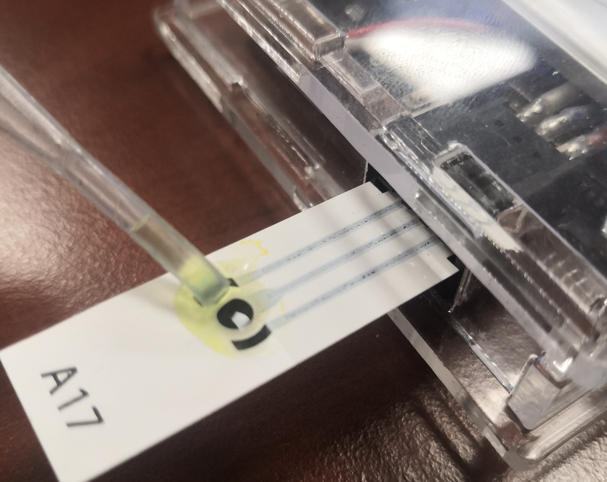
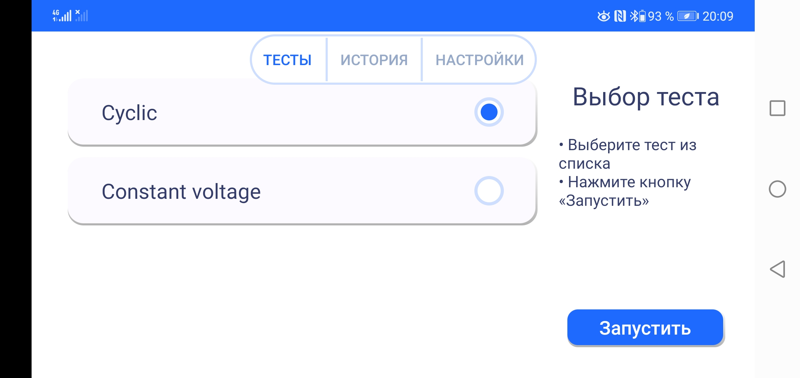

Программирование
================

Arduino IDE и загрузка прошивки в контроллер
______________________________________________

1. Скачайте(https://www.arduino.cc/en/software) установщик среды разработки Arduino IDE и установите.
2. Подключите потенциостат к компьютеру с запущенной средой Arduino IDE и включите его питание.
3. Скачайте(https://www.arduino.cc/en/software) и установите драйвер CH340.
4. Откройте диспетчер устройств на компьютере и убедитесь, что контроллер платы распознаётся компьтером (как показано на примере):

.. figure:: _static/Pictures/programming/CH340.png
    :scale: 50 %
    :align: center

5. Откройте Arduino IDE на компьютере и выберете порт устройства (как показано на примере):

.. figure:: _static/Pictures/programming/CH340A.png
    :scale: 60 %
    :align: center

6. Перейдём к установке библиотеки ESP32 в ArduinoIDE. Откроем настройки:

.. figure:: _static/Pictures/programming/settings.png
    :scale: 60 %
    :align: center

7. В поле `Дополнительные ссылки для Менеджера плат` вставим: `https://dl.espressif.com/dl/package_esp32_index.json,http://arduino.esp8266.com/stable/package_esp8266com_index.json` и нажмем `OK`.

8. Откроем `Менеджер плат`:

.. figure:: _static/Pictures/programming/manager.png
    :scale: 60 %
    :align: center

9. В поиске введём `esp32` выберем платы `esp32`, последнюю версию, и нажмём кнопку `Установка`:

10. Выберем плату `ESP32 Dev Module`:

.. figure:: _static/Pictures/programming/choosing.png
    :scale: 60 %
    :align: center

11. Откроем прошивку `FirmwireESP5.ino` и нажмём загрузку:

.. figure:: _static/Pictures/programming/download.png
    :scale: 60 %
    :align: center

GUI приложение
______________

1. [Скачаем]() архив `scripts.zip` и распакуем его.

2. [Установим](https://www.python.org/downloads/release/python-365/) Python 3.6.5.

3. Перейдём в распакованную папку `scripts` и запустим командную строку. Для этого в адресной строке введём `cmd`.

4. Установим необходимые библиотеки. Для этого введем команду `pip install -r requirements.txt`.

5. Введём команду `python main.py`.

6. При возникновении ошибок во время запуска, связанных с неустановленными библиотеками, выполнить команду `pip install <название недостающей библиотеки>`.

При успешном выполнении всех действий запустится окно программы:

.. figure:: _static/Pictures/programming/mainWindowStart.png
    :scale: 40 %
    :align: center

-----------------

Запуск измерения
-----------------

1. Для того, чтобы выполнить измерение потенциостатом, необходимо подключить прошитый потенциостат по USB к компьютеру и включим его питание (переключим выключатель в положение `ON`, светодиод загорится зелёным).

2. В ПО во вкладке `DEVICE CONNECTION` необходимо выбрать устройство. Для этого в поле `select your device` следует открыть список и выбрать порт подключенного потенциостата (узнать его можно в Диспетчере устройств во вкладке `Порты (COM и LPT)`). В данном случае порт `COM3`:

.. figure:: _static/Pictures/programming/COM3Port.png
    :scale: 40 %
    :align: center

3. Далее нажать кнопку `connect`. При успешном выполнении всех действий статус подключения изменится на `connected`:

.. figure:: _static/Pictures/programming/connected.png
    :scale: 40 %
    :align: center

4. Переходим к заданию параметров теста. Для этого перейдем во вкладку `TEST & PARAMETERS`:

5. Выбираем параметры теста. В поле `select test` доступен только параметр `CYCLIC`. Такой тип теста позволяет выполнить циклическую хроноамперометрию, то есть линейно изменять подаваемое напряжение, измеряя получаемый ток.

В разделе `Base Settings` выберем диапазон токов измерения `current range` равным `100 uA`, который соответствует данному потенциостату. В поле `sample rate` зададим частоту дискретизации (по умолчанию установлено значение `100 Hz`). Поля `quiet time` и `quiet value` для прошивки потенциостата текущей версии неактивны.

В разделе `Cyclic Voltammetry Settings` выберем скорость изменения напряжения в зависимости от поставленной задачи. Установим скорость `scan rate` равной `0.05 V/s`. Зададим предельные значения напряжений в полях `E min` и `E max` равными `-0.6 V` и `0.6 V`, соответственно.

В разделе `Data Output Settings` зададим форматы вывода данных. В колонке `output format` отметим необходимые для вывода форматы данных. В рамках данного примера ставим галочку для формата `csv`(пока неактивно для данной версии API). Выберем, сохранять ли, и выводить ли полученные графики? (Выяснить, не в Велене ли Цири? Выяснить, не в Новиграде ли Цири? Выяснить, не на Скеллиге ли Цири?)(пока неактивно для данной версии API). Для данного примера ставим обе галочки. В поле `except first` выберем, исключить ли первый цикл из эксперимента. оставим чекбокс пустым, чтобы сохранить первый цикл. Зададим количество циклов `test count` равным `3` и назовём тест `compound` именем `TEST1`.

6. Вставим бумажный электрод в разъём для электродов:

Если электрод слишком тонкий, подложим под него сложенную бумагу для уплотнения и лучшей фиксации:

7. Нанесём исследуемый раствор на электрод с помощью пипетки:

8. После проверки введённых настроек запустим тест кнопкой `Run Test!`.

9. Для дополнительного отслеживания прогресса можно наблюдать отправляемые потенциостату JSON-команды в командной строке:

.. figure:: _static/Pictures/programming/jsonCommands.png
    :scale: 60 %
    :align: center

10. После окончания проведения измерений при поставленных галочках ранее появятся графики экспериментов в новых окнах:

11. При поставленной галочке на сохранение данных теста в папке пользователя в `data` сохранятся данные теста (пока неактивно для данной версии API).

Android приложение
___________________

1. [Скачаем]() приложение `isc-3.apk` и установим его.

2. Включим питание прошитого потенциостата.

3. Подключим смартфон по Bluetooth к устройству с именем `Potentiostat`: 

-----------------

Запуск измерения
-----------------

1. Для того, чтобы выполнить измерение потенциостатом, необходимо подключить прошитый потенциостат по Bluetooth к смартфону и включить его питание (переключим выключатель в положение `ON`, светодиод загорится зелёным).

2. В ПО на начальном экране выберем устройство `Potentiostat` и нажмём `Подключиться`:

3. Далее во вкладке`Тесты` выберем режим измерений. В данном примере `Cyclic`:

Такой тип теста позволяет выполнить циклическую хроноамперометрию, то есть линейно изменять подаваемое напряжение, измеряя получаемый ток. После выбора типа теста нажимаем кнопку `Запустить`.

4. Откроется окно, в котором зададим параметры измерения: диапазон токов измерения `Current range` определим равным `100 uA` (соответствующее данному устройству), в поле `sample rate` зададим частоту дискретизации (по умолчанию установлено значение `100 Hz`):

5. Пропустим поля `Quiet time` и `Quiet value`, поскольку они неактивны для данной прошивки потенциостата. Зададим предельные значения напряжений в полях `Min value` и `Max value` равными `-0.6 V` и `0.6 V`, соответственно, для данного примера:

6. В поле `Scan rate` установим скорость изменения напряжения, равной `0.05 V/s`. В поле `Cycles` определим количество повторений цикла. Для данного примера значение равно `3`:

7. Вставим бумажный электрод в разъём для электродов:

Если электрод слишком тонкий, подложим под него сложенную бумагу для уплотнения и лучшей фиксации:

8. Нанесём исследуемый раствор на электрод с помощью пипетки:

9. После проверки введённых параметров нажмём кнопку `Запустить`. После этого начнётся эксперимент, который можно отслеживать в трёх режимах. Режим `Напряжение и время`:

Режим `Сила тока и время`:

Режим `Сила тока и напряжение`:

10. После завершения эксперимента получим графики. График `Напряжение и время`:

График `Сила тока и время`:

График `Сила тока и напряжение`:

11. Чтобы сохранить результаты теста, нажмём кнопку `Сохранить`:

12. Для того, чтобы посмотреть результаты сохраненного теста, откроем вкладку `История`:

Здесь выберем интересующий нас тест и нажмём кнопку `Просмотр`. После чего у нас появится результат теста, такой же, как сразу после его выполнения:

