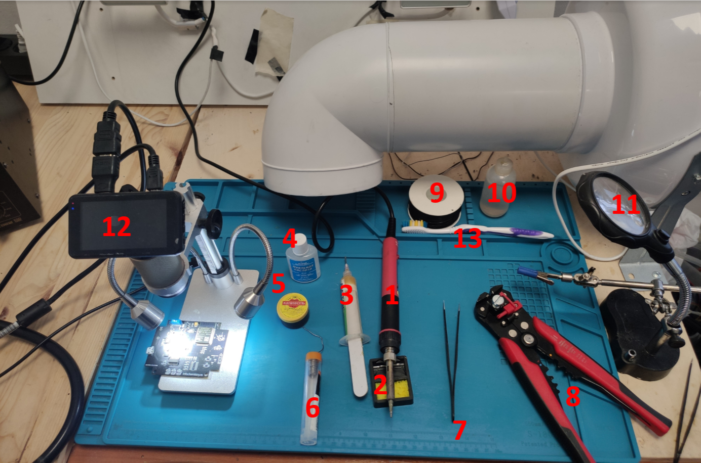
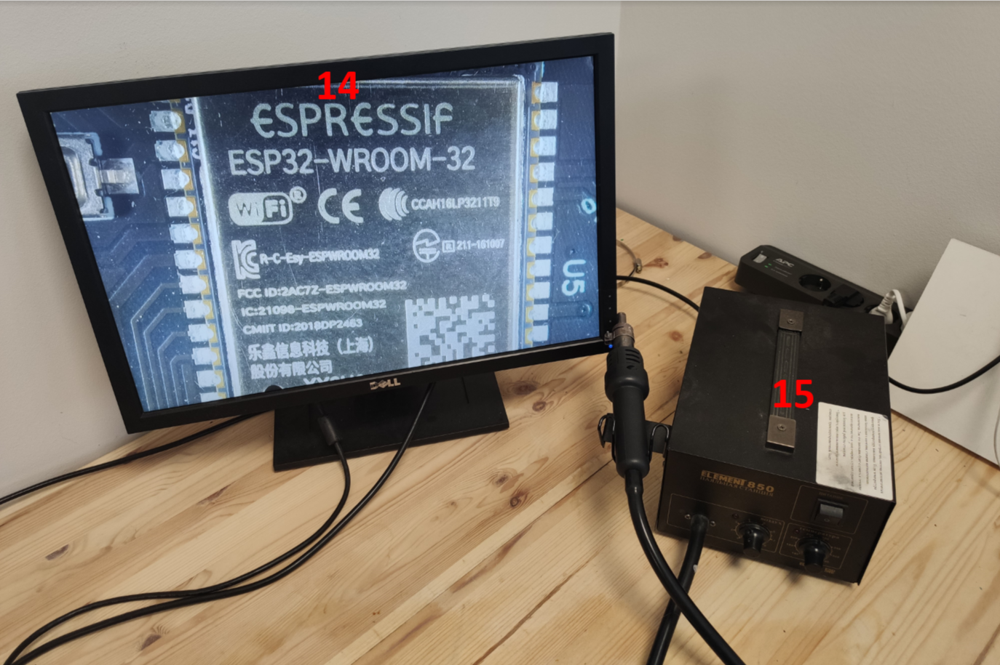

Пайка
======

Таблица со списком компонентов
_______________________________

.. csv-table:: Список компонентов
   :header: "Имя", "Наименование на плате", "Корпус"            
   :widths: 10, 10, 10

   "AD8608ARZ-REEL7", "U6", "SOIC-14_L8.7-W3.9-P1.27-LS6.0-BL"

   "micro USBFemale", "USB1", "MICRO-USB-SMD_5P-P0.65-H-F_C10418"

   "1k", "R17,R18,R19", "R0603"

   "1.2k", "R20,R7", "R0603"

   "10k", "R6,R14,R15,R10,R11", "R0603"

   "100", "R16", "R0603"

   "10u", "C1,C2,C5,C7,C13", "C0603"

   "0.1u", "C3,C4,C8,C10,C11,C14,C16,C17,C18", "C0603"

   "470p", "C6", "C0603"

   "10n", "C9,C12", "C0603"

   "100uF", "C15", "CASE-B_3528"

   "1N4148W", "D1,D2,D3,D4,D5,D6", "SOD-123FL_L2.6-W1.6-LS3.4-RD"

   "FS8205A", "Q3", "TSSOP-8_L4.4-W3.5-P0.65-LS6.4-BL"

   "8.06k", "R1", "R0603"

   "845", "R2,R8", "R0603"

   "100k", "R3,R4", "R0603"

   "16.2k", "R5", "R0603"

   "29.4k", "R9", "R0603"

   "AD5667RBRMZ-1REEL7", "U4", "MSOP-10_L3.0-W3.0-P0.50-LS4.9-BL"

   "ESP32-WROOM-32", "U5", "WIFIM-SMD_39P-L25.5-W18.0-P1.27"

   "K2-3.6×6.1_SMD", "KEY1,KEY2", "KEY-SMD_2P-L6.2-W3.6-LS8.0"

   "220", "R12,R13", "R0603"

   "CH340C", "U8", "SOP-16_L10.0-W3.9-P1.27-LS6.0-BL"

   "BATTERY", "BAT1", "LIPO-1100MAH"

   "ADG736BRMZ", "U3,U2", "MSOP-10"

   "AMS1117-3.3", "U7", "SOT-223-3_L6.5-W3.4-P2.30-LS7.0-BR"

   "DW01A_C436931", "U9", "SOT-23-6_L2.9-W1.6-P0.95-LS2.8-BL"

   "TP4056_C725790", "U10", "ESOP-8_L4.9-W3.9-P1.27-LS6.0-BL-EP"

   "LED-0805_G", "LED1", "LED0805_GREEN"

   "MIC5205-3.3YM5", "U1", "SOT-23-5_L3.0-W1.7-P0.95-LS2.8-TL"

   "HDR-M-2.54_1x4", "J1", "HDR-M-2.54_1X4"

   "DS-01BP", "SW1", "SW-TH_DS-01BP"

   "LED-0805_B", "LED2", "LED0805_BLUE"

   "LED-0805_R", "LED3", "LED0805_RED"

_____________________________________________

Список необходимых инструментов
_________________________________

--------------------------------------

.. csv-table:: 
   :header: "Номер", "Наименование"
   :widths: 10, 10

   1, "Паяльник"

   2, "Подставка для паяльника с губкой"

   3, "Флюс для пайки"

   4, "Флюс для пайки (паяльная кислота)"

   5, "Флюс для пайки (канифоль)"

   6, "Припой Sn40Pb60 235 град."

   7, "Пинцет"

   8, "Инструмент для снятия изоляции"

   9, "Провода"

   10, "Вода для смачивания губки"

   11, "Держатель третья рука"

   12, "Микроскоп"

   13, "Щетка для отмывания плат"

   14, "Монитор для микроскопа"

   15, "Паяльный фен"

-----------------------------

Паяльник
-----------------

Паяльник - устройство для нагрева припоя, контактов, компонентов платы. В данном пособии используется паяльник.

-----------------------------

Припой
-----------------

В данном пособии используется припой Sn40Pb60 с температурой плавления 235 град. и диаметром 1 мм.

-----------------------------

Флюс
-----------------

При пайке далее будем использовать нейтральный флюс - гель (номер 3). 

Паяльная кислота (номер 4) обычно - это раствор ортофосфорной кислоты, которая является самым агрессивным флюсом для человеческой кожи, поэтому при ее использовании надо настороженно соблюдать технику безопасности и просто быть более внимательным. Для пайки микросхем не подходит, так как она легко может растворить мелкие части дорожек или контактов платы.

Под номером 5 можно увидеть твердую канифоль. Ее также можно использовать для пайки, но ее сложнее будет отмыть. 

После пайки необходимо промыть плату в растворе спирта.

-----------------------------

Фен
-----------------

При пайки феном нужно руководствоваться следующими правилами:  

+ Температуру нагрева следует регулировать в зависимости от выполняемой работы, размера компонента и вида припоя.

+ Скорость потока воздуха должна быть наименьшей, иначе при работе фен может сдуть соседние мелкие компоненты. Но от нее зависит скорость прогрева, поэтому ее нужно регулировать индивидуально.

+ Фен комплектуется несколькими насадками, которые регулируют мощность воздушного потока. Правило простое – для мелких деталей лучше выбирать узкую насадку.

+ При нагреве припой, закрепляющий соседние компоненты, может размягчиться. Тогда эти детали сдвинутся, нарушится контакт между ними, и плата будет работать некорректно. Во избежание этого их нужно экранировать фольгой или термоскотчем, чтобы они не нагрелись.

+ Фен нужно держать строго перпендикулярно поверхности платы (В дальнейших видео из-за микроскопа это было невозможно, поэтому фен держался под определенным углом).

-----------------------------

Микроскоп
-----------------

Для пайки мелких smd компонентов необходим микроскоп. К примеру для пайки FS8205A в корпусе TSSOP-8 без микроскопа не обойтись, так как можно не заметить невооруженым глазом припоя между контактами или артефактов по типу криво-припаянной ножки.

-----------------------------

Пинцет
-----------------

Пинцет необходим для размещения компонентов на плату, а также их перемещения во время нагрева.

-------------------------------

Медная лента для снятия припоя
-------------------------------

Медная лента необходима в случае, если нужно убрать лишний припой с дорожек платы. Для этого необходимо приложить ленту к месту с припоем, потом приложить паяльник поверх ленты и нагреть, пока припой не впитается в ленту, после чего ее можно немного продвинуть дальше, чтобы впитать весь припой.

___________________

Инструкция к пайке
___________________

Подготовка губки для жала
-------------------------------

.. figure:: _static/Pictures/soldering/Sponge.jpg
    :scale: 10 %
    :align: center

Перед пайкой необходимо увлажнить губку так, чтобы она была не слишком влажная и не сухая. 
Жало паяльника вытирается о губку, при этом он должен быть горячим. Грязь с конца жала должна отстать.

-------------------------------

Выбор жала
-------------------------------

Основными типами жал для паяльников сегодня являются:

+ медное стержневое, используемое в классическом варианте паяльника с нихромовым нагревателем;

+ съёмное с никелевым покрытием, используемое в паяльниках с керамическим нагревателем;

+ в виде короткозамкнутого медного витка, применяемое в импульсных паяльниках;

+ специальное, с ферромагнитным слоем для индукционного паяльника.

Для пайки микросхем в основном используются с никелевым покрытием или медные стержневые. при этом, если медное жало можно чистить с помощью наждачной бумаги, снимая таким образом оксидный слой для лучшего прилипания к жалу припоя, то жало с никелевым покрытием можно очищать только смоченной губкой, иначе можно повредить покрытие и припой перестанет прилипать.
В данном пособии используется жало с никелевым покрытием.

-----------------------------------

Оптимальные температуры паяльника
-----------------------------------

Оптимальные температуры паяльника необходимо выбирать по рекомендациям производителя припоя. Для припоя из Sn40Pb60 производитель рекомендует 235 градусов.

-------

Флюс
-------

Если вы используете паяльный гель или канифоль, то такие флюсы можно наносить жалом паяльника, предварительно нагрев его до определенныз температур. Например канифоль плавится примерно при температурах 100-130 град. 
Удобнее всего использовать флюс в специальных тюбиках-шприцах, из которых удобнее всего его выдавливать на плату.

---------------------

Пайка CH340C SOP-16
---------------------

.. figure:: _static/Pictures/soldering/1.jpg
    :scale: 10 %
    :align: center

---------------------

Нанесение флюса
---------------------

Используется несмываемый такой-то....флюс.
Аккуратно наносите его на контактные площадки, после чего туда необходимо с помощью паяльника нанести небольшое количество припоя.

.. figure:: _static/Pictures/soldering/2.jpg
    :scale: 10 %
    :align: center

------------------------------

Установка компонента на плату
------------------------------

.. figure:: _static/Pictures/soldering/3.jpg
    :scale: 10 %
    :align: center

Устанавливаем корпус на контактные дорожки поверх флюса, пинцетом его двигаем так, чтобы все контакты совпали между собой.

------------

Пайка феном
------------

Температуру для фена выбираем в зависимости от припоя. Аккуратно нагреваем чип, если он съезжает, то поправляем пинцетом.

.. figure:: _static/Pictures/soldering/4.jpg
    :scale: 10 %
    :align: center

-------------------

Проверка контактов
-------------------

Проверить удачно ли вы спаяли плату можно: 

1) глазами; 

2) камерой телефона; 

3) микроскопом.

Необходимо проверить каждый контакт на наличие лишнего припоя, который может замкнуть соседние контакты.

.. figure:: _static/Pictures/soldering/5.jpg
    :scale: 10 %
    :align: center

-------------------

Пайка конденсатора
-------------------

https://niuitmo-my.sharepoint.com/:v:/g/personal/onisoris_niuitmo_ru/EU2iRAz2NZBCvQxo4NaqD1EBcPs8Fj8cbAI7xY1WFhsXmQ?e=cNN0DL

-------------------

Пайка FS8205A
-------------------

https://niuitmo-my.sharepoint.com/:v:/g/personal/onisoris_niuitmo_ru/EU2iRAz2NZBCvQxo4NaqD1EBcPs8Fj8cbAI7xY1WFhsXmQ?e=cNN0DL

-------------------------------

Пайка стабилизатора напряжения
-------------------------------

https://niuitmo-my.sharepoint.com/:v:/g/personal/onisoris_niuitmo_ru/EU2iRAz2NZBCvQxo4NaqD1EBcPs8Fj8cbAI7xY1WFhsXmQ?e=cNN0DL

